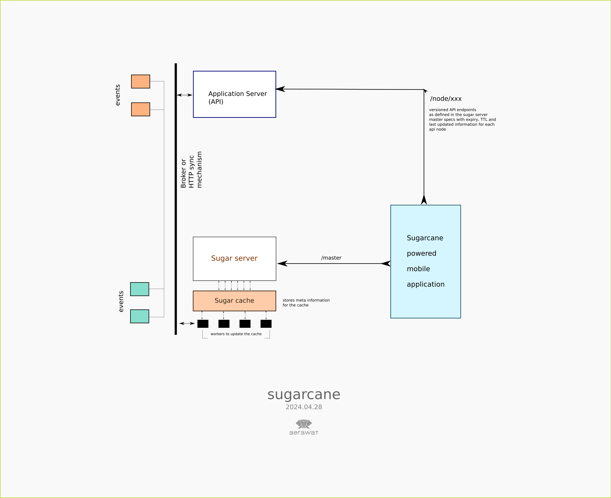

# Sugarcane - Cache Mock





## Routes
- Master Schema - `/cdn/master`
- Node Data - `/cdn/get/<version>/<node_name>`


## TTL Distribution
- keep master schema ttl to be less, eg. 300 Seconds
- keep node data ttl to be higher, eg. 1 Day


# How application should work ?
- application is supposed to query the master schema as the metadata for object endpoints
- each object endpoint api is found in the response of the master schema


**/cdn/master**
```
{
    "expires_on": "",
    "updated_on": "",
    "scheme": "master",
    "nodes": {
        "post": {
            "expires_on": "2024-03-20 00:50:19.208527",
            "updated_on": "2024-03-20 00:49:59.208529",   
            "url": "/cdn/get/v5.6.69/emoji",
            "version": "v5.6.69"
        }, 
        "food": {
            "expires_on": "2024-03-20 00:50:19.208507",
            "updated_on": "2024-03-20 00:49:59.208511",
            "url": "/cdn/get/v7.6.89/food",
            "version": "v7.6.89"
        },
        "people": {
            "expires_on": "2024-03-20 00:50:19.208549",
            "updated_on": "2024-03-20 00:49:59.208552",
            "url": "/cdn/get/v8.5.69/people",
            "version": "v8.5.69"
        },
        "post": {
            "expires_on": "2024-03-20 00:50:19.208444",
            "updated_on": "2024-03-20 00:49:59.208457",
            "url": "/cdn/get/v6.1.32/post",
            "version": "v6.1.32"
        },
        "user": {
            "expires_on": "2024-03-20 00:50:19.208487",
            "updated_on": "2024-03-20 00:49:59.208490",
            "url": "/cdn/get/v8.5.65/user",
            "version": "v8.5.65"
        }
    }
}
```

**/cdn/get/v8.1.68/post**
```
{
    "scheme": "node",
    "node": "post",
    "version": "v8.1.68",
    "expires_on": "2024-03-11 16:02:05.040831",
    "updated_on": "2024-03-11 15:02:05.040831",
    "data": [
        {
            "id": 1,
            "value": "https://picsum.photos/id/321/200/300?type=post"
        },
        {
            "id": 2,
            "value": "https://picsum.photos/id/426/200/300?type=post"
        },
        {
            "id": 3,
            "value": "https://picsum.photos/id/246/200/300?type=post"
        },
        {
            "id": 4,
            "value": "https://picsum.photos/id/629/200/300?type=post"
        },
        {
            "id": 5,
            "value": "https://picsum.photos/id/702/200/300?type=post"
        },
        {
            "id": 6,
            "value": "https://picsum.photos/id/913/200/300?type=post"
        },
        {
            "id": 7,
            "value": "https://picsum.photos/id/361/200/300?type=post"
        },
        {
            "id": 8,
            "value": "https://picsum.photos/id/216/200/300?type=post"
        },
        {
            "id": 9,
            "value": "https://picsum.photos/id/528/200/300?type=post"
        }
    ]
}
```

## Running
- in a virtualenv install requirements.txt
- `pip install -r requirements.txt`
- `python main.py`

### How does it work
`python faker.py` 
- Generates master and node data inside the content folder
- `content/nodes/<nodename>/v<semver>.json` is the node file
- `content/master.json` is the master file poiting references to each node file


While serving the endpoints
- checks on redis cache
- if not found, checks on the previously expired log
- if not in expired, checks the file
- if file found and is not expired, then serves the file and loads to redis again
- else aborts as expired

## X-CACHE headers
- X-CACHE = HIT (served from Redis)
- X-CACHE = MISS (served from the content file)
